# Amazon.CO2-Client

## Technologies used

- [React](https://reactjs.org/) single page application
- Routing done using [React Router](https://reactrouter.com/en/main)
- State management via [Redux](https://redux.js.org/)

## Setup

1. Clone the repository and install the dependencies

```bash
npm install
```

2. Start the frontend application locally

```bash
npm run dev
```

3. Build the frontend application locally

```bash
npm run build
```

## Screens

### Home Screen

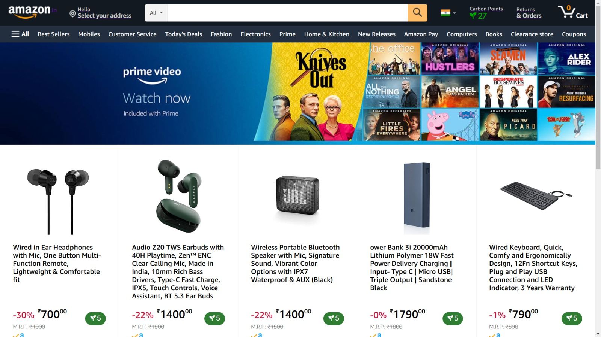

### Product Screen

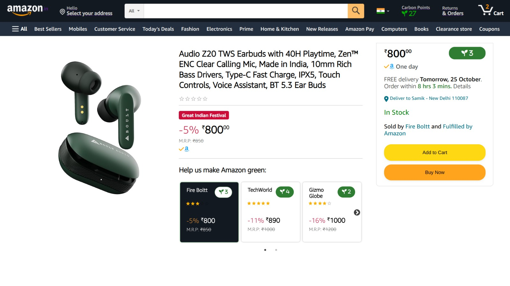

### Cart Screen

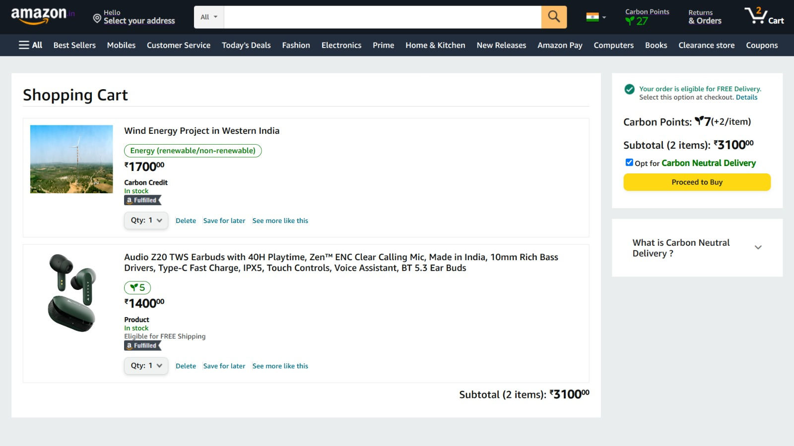

### Carbon Screen

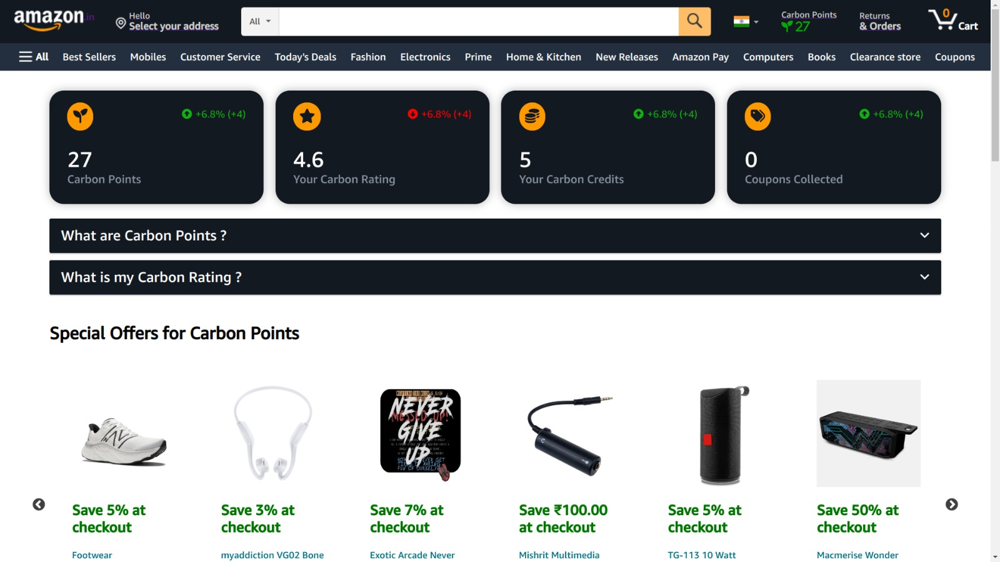
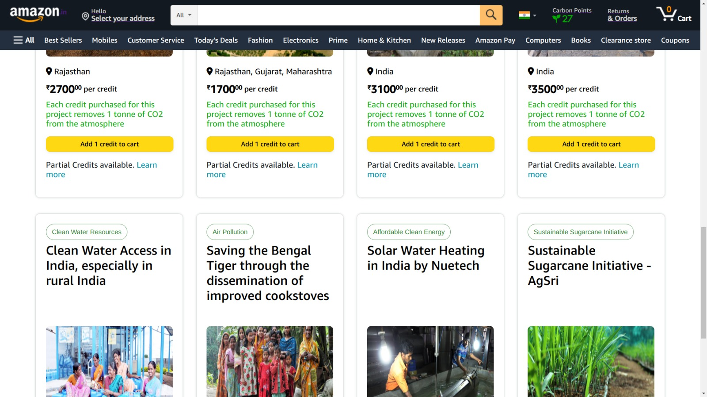

### Auth Screen

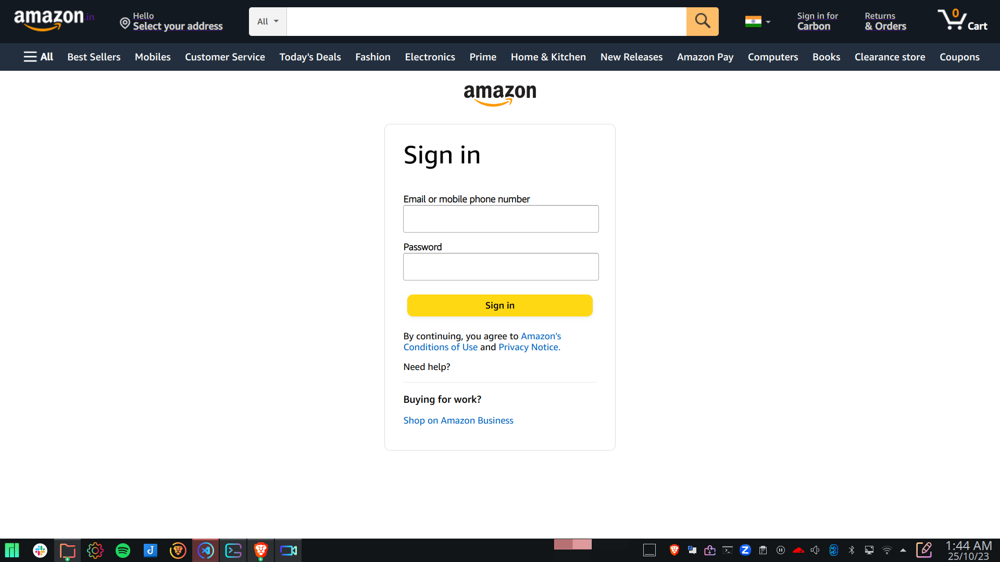

## Features and Functionality

### Carbon Points

- Carbon Points are a loyalty reward point system based upon the carbon friendliness of the supplier.
- When a user buys a particular product, they gain carbon points equivalent to the carbon rating of the seller.
- The carbon rating of the seller is being calculated by Amazon.CO2 Visualizer

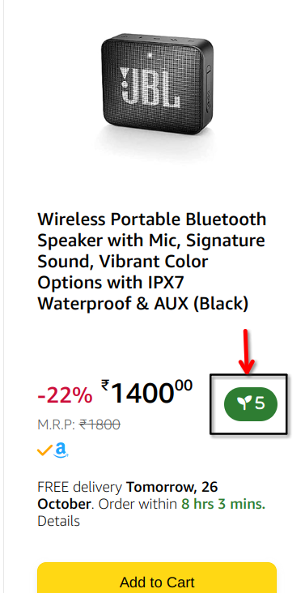 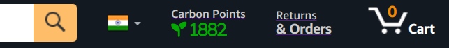

### Multiple Seller Selection

- Users have an option to select the seller of their choice based upon their tolerance for selling price and carbon ratings
- Users are put in control of how carbon friendly they wish to be
- Using this psychology, its not just Amazon that contributes to becoming caron friendly but also the user

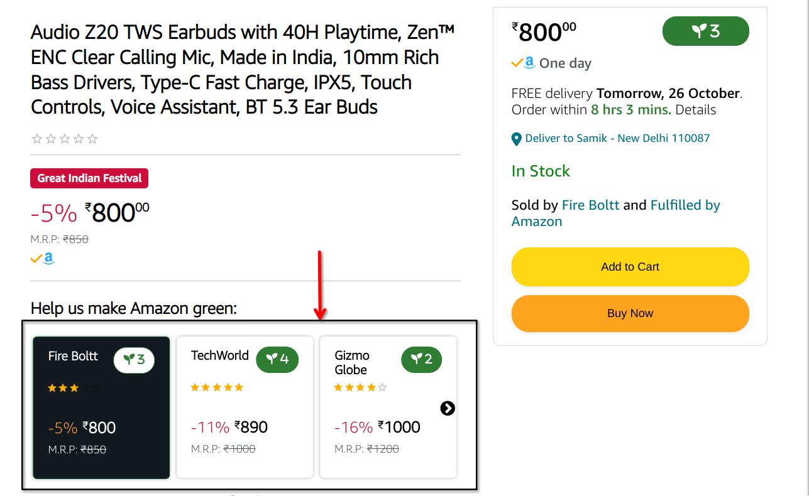

### Higher Discoverability Rate for Carbon Friendly Sellers

- A seller having a higher carbon rating will have a higher discoverability rate
- Pushes the seller to become more carbon friendly in order to attain higher carbon rating
  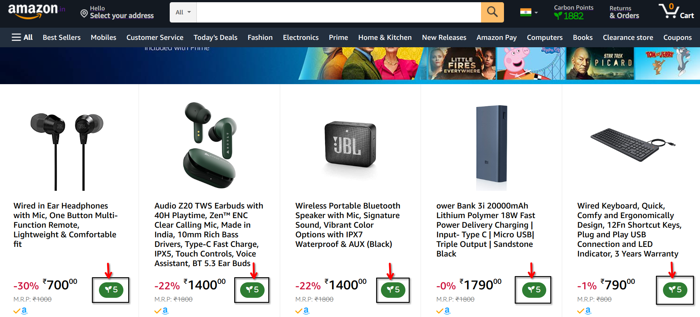

### Gamification for Carbon Points

- Explores the use of Carbon Points
- Increases level of engagement for users
  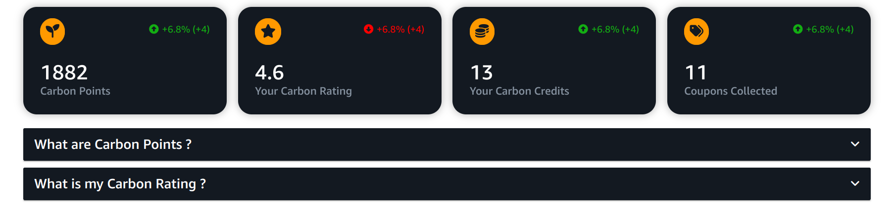

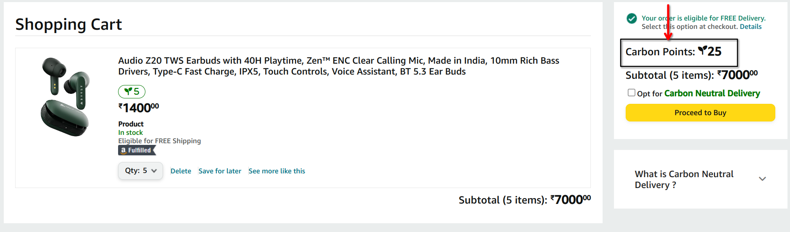

### Special Offers for Carbon Points

- Exclusive offers that can be bought by Carbon Points
- Includes milestone offers such as Prime Membership Redemption
  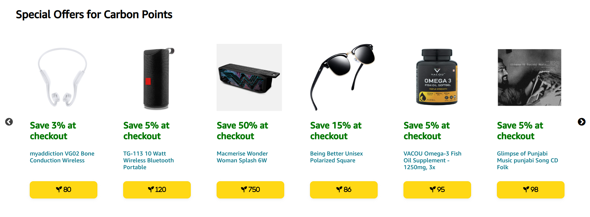

### Carbon Neutral Delivery

- Recollection of product packaging by the delivery person which is recycled therafter
- Provides +2 Carbon Points for each product when opted for
  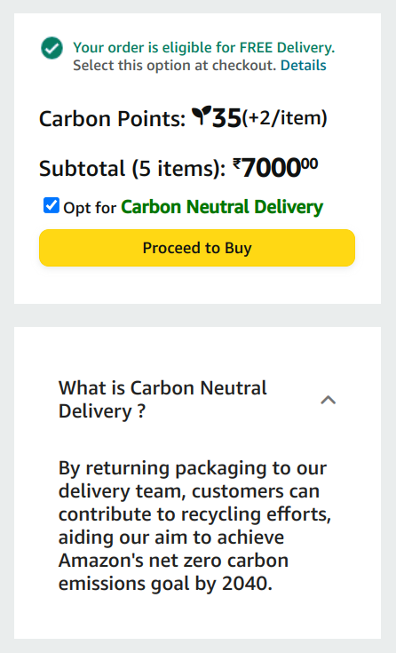


### Carbon Credits
- Carbon credits are like certificates that show someone did something good for the environment to make up for the greenhouse gases they released. These certificates can be bought and sold, and they help balance emissions to fight climate change.
- Amazon's plan to become carbon neutral by the year 2040, thus they are heavily in sustainabilty and carbon offset projects.
- Involves the users in creating a carbon friendly environment by selling carbon credits for these projects.
- Can be bought by carbon points and currency
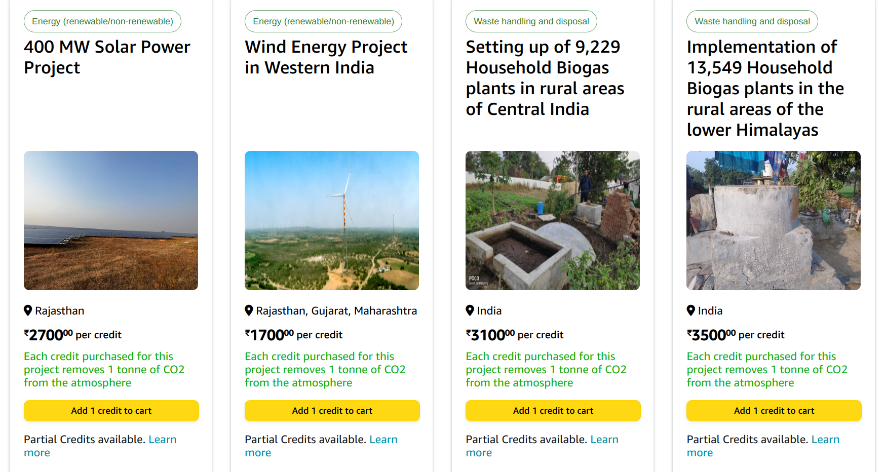
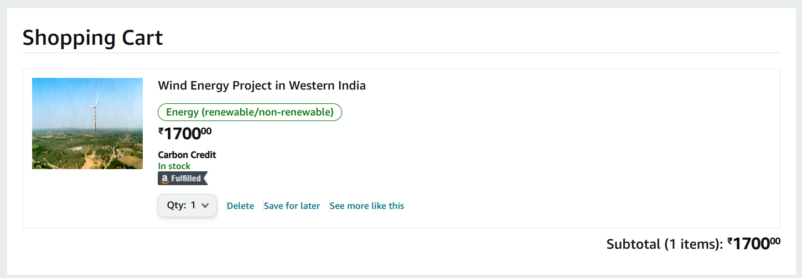

### Partial Carbon Credits
- Concept of partial carbon credits
- Budget friendly and affordable for everyone
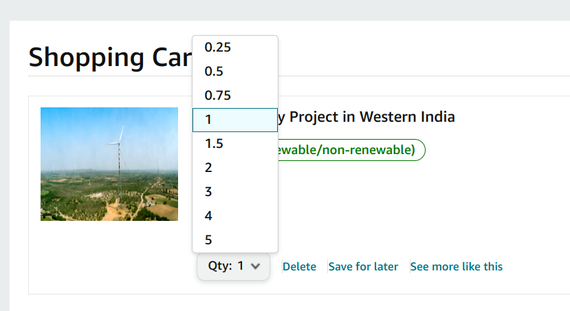

